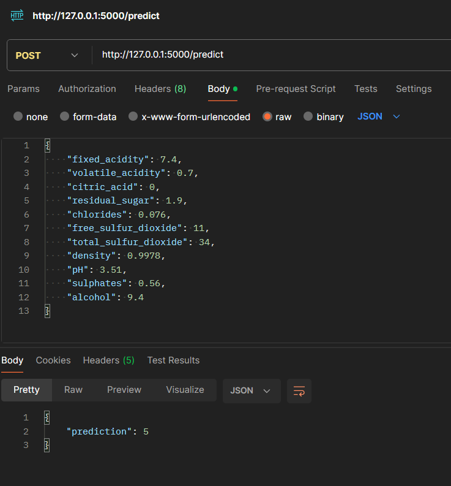

# Flask - Wine

## Descripción:
Este proyecto es una API con interfaz web que permite obtener la calidad de un vino a partir de sus características. 

## Instalación:
Ejecutar el archivo main.py.

## Uso:
Para utilizar la API se debe ingresar a la dirección http://localhost:5000/ y llenar los campos con las características 
del vino. Una vez llenados los campos, se debe presionar el botón "Predecir" para obtener la calidad del vino.

## Documentación:

### Rutas:
- `/` : Ruta principal de la API.
- `/predict` : Ruta que recibe los datos del vino y devuelve la calidad del vino.

### Métodos:
- `GET` : Método que se utiliza para obtener la página principal de la API.
- `POST` : Método que se utiliza para enviar los datos del vino y obtener la calidad del vino.

### Parámetros:
- `fixed_acidity` : Acidez fija del vino.
- `volatile_acidity` : Acidez volátil del vino.
- `citric_acid` : Ácido cítrico del vino.
- `residual_sugar` : Azúcar residual del vino.
- `chlorides` : Cloruros del vino.
- `free_sulfur_dioxide` : Dióxido de azufre libre del vino.
- `total_sulfur_dioxide` : Dióxido de azufre total del vino.
- `density` : Densidad del vino.
- `pH` : pH del vino.
- `sulphates` : Sulfatos del vino.
- `alcohol` : Alcohol del vino.

### Ejemplo:
- `fixed_acidity` : 7.4
- `volatile_acidity` : 0.7
- `citric_acid` : 0
- `residual_sugar` : 1.9
- `chlorides` : 0.076
- `free_sulfur_dioxide` : 11
- `total_sulfur_dioxide` : 34
- `density` : 0.9978
- `pH` : 3.51
- `sulphates` : 0.56
- `alcohol` : 9.4

### Respuesta:
- `quality` : 5

Para usar la API con Postman, modificar el código de la siguiente manera:

1. Ruta Predict línea 14, 15:
```python
data = request.get_json()
# data = request.form
```

2. Ruta Predict línea 33, 34:
```python
return jsonify({'prediction': prediction}), 200
# return render_template('index.html', prediction=prediction)
```

Con esto se puede usar la API con Postman.

Respuesta de Postman:



## Créditos:
- [Sergio López Férnandez](https://github.com/a21lofese)
